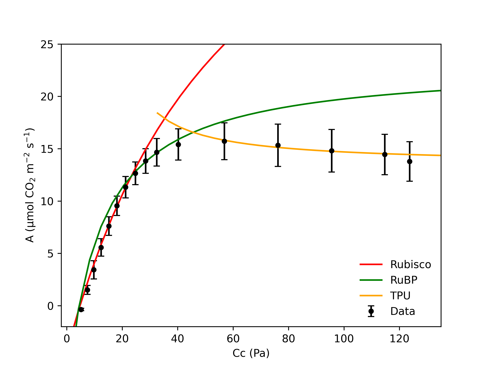

# Custom scripts from Fu et al

### 1. Modeling photosynthetic responses to carbon dioxide concentration (*A/Ci* curve)

A Python script `modeling_photosynthesis_to_CO2_ACi.py`

- Cleaning the LI-6800 data from csv files in the folder `data_ACi`

- Fitting the *Farquhar, von Caemmerer and Berry (FvCB) Model* with two terms `αG`  and `αS` , where `αG` is the proportion of the glycolate carbon exported from the photorespiratory pathway as glycine, and `αS` the proportion of the glycolate carbon exported as serine. The model is based on *[Busch et al.,2018](https://doi.org/10.1038/s41477-017-0065-x)*.

- Obtaining and summarizing the statistics of the fitting parameters, including `Vcmax` (the maximal rubisco carboxylation rate),  `J` (the maximum rate of electron transport), `Tp` (the rate of triose phosphate export from the chloroplast), `αG`  and `αS`. 

- Plotting the measured data with the three biochemical limitation curves

  - A replicate with the fitted curve:
  
  
  - All replicates (mean +- SD) with the fitted curves:
  

- Results are in the folder `output_ACi`.

  

### 2. Modeling photosynthetic responses during oxygen transients

An R script `modeling_photosynthesis_O2_transient.R`

- Fitting one-phase exponential functions to the time course data of net CO2 assimilation rate (A) from the folder `data_O2_transient`, including the low oxygen (2% O2) to high oxygen (40% O2) transition and the high oxygen (40% O2) to low oxygen (2% O2) transition.

- Integrating the area between the fitted curve and the baseline of the new steady-state A.

- Plotting the measured data with the fitted curves

  - A replicate with the fitted curve and integrated area from 2% O2 to 40% O2:
    

  - All replicates with fitted curves from 2% O2 to 40% O2:

    

  - A replicate with the fitted curve and integrated area from 40% O2 to 2% O2:
    
    
  - All replicates with fitted curves from 40% O2 to 2% O2:
     

- Results are in the folder `output_O2_transient`
